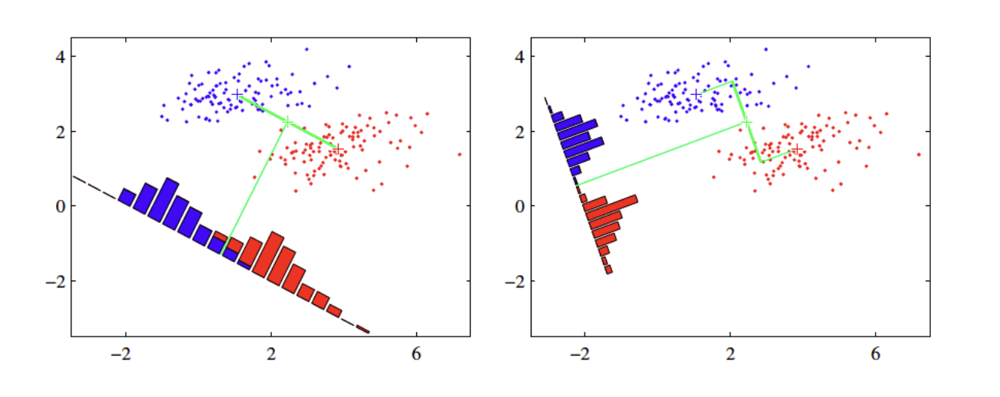

```{r setup, include=FALSE}
knitr::opts_chunk$set(echo = TRUE)
```

이번 시간에는 아래 두가지 모델을 이용하여 분류에 대해 학습합니다.   

-   로지스틱회귀    
-   선형판별분석(linear discriminant analysis)    

## 로지스틱 회귀(logistic regression)   

로지스틱 회귀는 비록 회귀라는 이름을 가지고 있지만 분류기로 자주 사용됩니다. 분류 문제는 결국 결과 변수가 범주 변수(category)일 때 결과가 특정 범주일 확률을 구하는 문제로 볼 수 있습니다.     

예를 들어 결과 변수의 범주가 2개라고 하고(편의상 1/0으로 코딩), 예측 변수를 이용하여 결과 변수의 범주를 예측하는 분류 문제를 보겠습니다. 즉, P(Y=1|X) - 편의상 P(X)로 표기 - 를 구하는 문제입니다.      

로지스틱 함수를 살펴봅시다.    

$$y = \frac{1}{1 + e^{-x}}$$
로지스틱 함수의 출력값은 항상 0에서 1사이입니다. 시그모이드 모양을 가져서 시그모이드 함수라고도 합니다.  

아래와 같이 결과 변수의 오즈(odds) - 오즈는 어떤 사건이 일어날 가능성으로 성공확률/실패확률, 즉 P/(1-P)를 말합니다 - 를 선형 함수로 모델링한다고 해봅시다.        
$$\frac{P(X)}{1-P(X)} = \beta_0+\beta_1X$$

위 식에서 좌변은 0에서 무한대인데 반해 우변은 모든 범위의 값이 가능합니다. 양변의 범위가 맞지 않죠. 

이 문제를 해결하기 위해 좌변에 log 를 취합니다. odds의 로그 변환을 logit 변환이라고 부릅니다.   

$$\frac{P(X)}{1-P(X)} = e^{\beta_0+\beta_1X}$$

$$log(\frac{P(X)}{1-P(X)}) = \beta_0 + \beta_1X$$ 


위 식을 정리하면 다음과 같이 됩니다.   
$$P(X) = \frac{1}{1+e^{-(\beta_0+\beta_1X)}}$$

앞에서 보았던 로지스틱 함수의 형태가 됩니다.   
logistic regression은 결국 linear model의 일반화인 것입니다.       


## 예제: titanic survival classification    

타이타닉호의 생존 데이터에서 생존 여부를 예측하는 분류 모델을 만들어봅시다.   

```{r}
library(carData)
```

```{r}
str(TitanicSurvival)
```

```{r}
summary(TitanicSurvival)
```

결측치(age, NA's)가 있는 레코드는 일단 제거하기로 합니다(결측치의 처리 방법에 대해서는 뒤에 좀 더 자세히 다루기로 합니다.)  
```{r}
TitanicSurvival = TitanicSurvival[complete.cases(TitanicSurvival),]
```

다음으로 logistic regression model을 데이터에 적합시켜봅시다(fit).  
```{r}
glm.fit = glm(survived ~., data = TitanicSurvival, family = "binomial")
```

모델 적합의 결과를 살펴봅시다.   
```{r}
summary(glm.fit)
```

로지스틱 회귀에서 계수 추정은 최대가능도 추정법(maximum likelihood estimation)을  사용합니다. 이에 대한 자세한 설명은 생략하고, 우리는 모델 적합의 결과를 어떻게 해석할 것인지에 우선 집중하기로 합니다.   

그러나, 가능도(우도)와 최대가능도 추정의 개념에 대해서는 스스로 공부해서 꼭  이해하시기 바랍니다.               

남자와 여자의 생존 확률을 비교해봅시다. 어느 쪽이 얼마나 큽니까?   

male의 계수 추정치는 -2.49 입니다. 로지스틱 회귀 모델의 결과 변수는 *odds의 로그변환 값*이라는 것을 기억합시다. 따라서, odds ratio는 계수 추정치의 자연지수 변환이 됩니다.  
$$log(odds_m) - log(odds_f) = log(\frac{odds_m}{odds_f}) = \beta_x$$
```{r}
exp(coef(glm.fit)[2])
```

male의 생존 odds는 female의 생존 odds의 0.08배 입니다. 즉, 여성의 생존 오즈는 남성보다 10배 이상 큽니다.  

유의성 여부에 대한 통계적 검정 결과가 z 값과 p-value로 제시되어 있습니다. 

로지스틱 회귀 모델의 적합도에 대한 통계적 검정을 위해 일반적으로 가능도 비율 검정법(likelihood ratio test)을 사용합니다.    
```{r}
library(lmtest)
glm.fit.null = glm(survived ~ 1, data = TitanicSurvival, family = "binomial")
lrtest(glm.fit, glm.fit.null)
```


1등칸에 비해 2등칸과 3등칸에 탄 승객들의 생존 오즈비는 얼마일까요?    
독립 변수가 범주형 변수일 때, 회귀 모델에서는 이를 dummy variable로 변환합니다.     

```{r}
contrasts(TitanicSurvival$passengerClass)
```

## 분류 정확도(Classification accurancy)   

분류 정확도를 어떻게 평가할까요?   

먼저, 위에서 만든 모델을 사용하여 타이타닉호의 생존 결과를 예측해봅시다.  
```{r}
prob = predict(glm.fit, type = "response") 
head(prob)
```

이제, 분류 예측 정확도를 계산해봅시다.     
```{r}
pred = rep("no", length(prob))
pred[prob>0.5] = "yes"
mean(pred == TitanicSurvival$survived)
```

위의 예제는 training data 에서 성능을 평가한 것이고, 우리가 실제로 관심이 있는 것은 모델 훈련에 사용되지 않은 새로운 데이터셋에서의 성능일겁니다.   

아래는 전체 데이터셋을 training set과 test set으로 나누고, training set에서 만든 모델을 test set에 적용해 성능을 평가한 것입니다.  

```{r}
set.seed(1)
cnt = dim(TitanicSurvival)[1]
index = sample(cnt, round(cnt/7), replace = F)
train.data = TitanicSurvival[index,]
test.data = TitanicSurvival[-index,]
```

로지스틱 회귀 모델을 학습 데이터에 적합시키고, 검정 데이터에 적용하여 예측값을 얻습니다.   
```{r}
glm.fit = glm(survived ~., data = train.data, 
              family = "binomial")
prob = predict(glm.fit, test.data, type = "response")
```

confusion matrix를 출력하고, 정확도를 계산합니다.     
```{r}
pred = rep("no", cnt-round(cnt/7))
pred[prob>0.5] = "yes"
table(pred, test.data$survived)
mean(pred == test.data$survived)
```


## 선형판별분석(Linear discrminant analysis, LDA)    

로지스틱 회귀는 로지스틱 함수를 이용하여 두 개의 반응 변수 클래스에 대해 $Pr(Y=k|X=x)$를 직접 모델링하는 것입니다. 

이제 LDA라고 불리는 대안 기법에 대해 알아봅시다.    

LDA에서는 반응 변수 Y의 각 클래스내의 관측치들이 클래스 별로 평균($\mu_k$)과 클래스 공통 분산($\sigma^2$)을 갖는 정규분포를 따른다는 가정하에 이 파라미터에 대한 추정값을 베이즈 분류기에 대입한 것입니다. 

베이즈 뷘류기(Bayes classifier)는 설명변수 X가 $x$로 주어졌을 때 반응변수 Y가 $k$ 클래스일 확률을 베이즈 정리를 이용해 구하고, 이에 따라 관측치를 분류합니다.   

$$P(Y=k|X=x)$$

베이즈 정리(Bayes theorem)        
$$P(B|A) = \frac{P(A|B)\times P(B)}{P(A)}$$

베이즈 정리를 베이즈 분류기에 적용하면 아래 식이 된다.    
$$P(Y=k|X=x) = \frac{P(X=x|Y=k) \times P(Y=k)}{\sum_{l=1}^k P(X=x|Y=l)}$$    

위 베이즈 정리가 의미하는 것은 $P(Y=k|X=x)$ - 사후 확률이라고 한다 - 를 구하기 위해 사전 확률 $P(Y=k)$와 조건부 확률밀도 함수 $P(X=x|Y=k)$를 이용하는 것입니다.   

$P(Y=k)$ 추정치는 k번째 클래스에 속하는 관측치들의 비율입니다.       

$P(X=x|Y=k)$을 구하기 위해 LDA는 아래와 같은 가정을 합니다.   

1. $P(X=x|Y=k)$은 정규 분포를 따른다.      
2. 공통 분산을 갖는다(common variance across different k class)       

우리는 위 가정과 k 클래스에 속한 관측치에서 확률밀도함수 $P(X=x|Y=k)$와 $P(Y=k)$를 추정할 수 있습니다. 


이들을 위 베이즈 정리에 대입하면 아래와 같은 선형판별함수를 얻을 수 있습니다.   
     
$$\hat{\delta_k} = x\times\frac{\hat{\mu_k}}{\hat{\sigma}^2}-\frac{\hat{\mu_k}^2}{2\hat{\sigma}^2}+log(\hat{\pi_k})$$

$$\hat{\mu_k} = \frac{1}{n_k}\sum_{i:y_i=k}^{n}x_i$$

$$\hat{\sigma^2} = \frac{1}{n-K}\sum_{k=1}^{K}\sum_{i:y_i=k}(x_i-\hat{\mu_k})^2$$
$$\hat{\pi_k}=\frac{n_k}{n}$$ 

LDA 분류기는 위식에서 $\hat{\delta_k}$ 값이 최대가 되는 클래스 k에 관측치($X=x$)를 할당합니다.   

위 식을 선형판별함수(linear disciminant function)이라고 하는 것은 위 판별함수가 x의 선형함수이기 때문입니다.     

**figure** 


LDA는 나중에 살펴볼 PCA (principal component analysis)와 매우 유사하다. 어떤 유사점과 차이점이 있는지 알아보자.   

[LDA & PCA](https://www.youtube.com/watch?v=azXCzI57Yfc)   


## 로지스틱 회귀 vs. LDA   

로지스틱 회귀와 비교하여 LDA의 장점은 다음과 같습니다.  

클래스의 수가 2보다 많은 반응 변수를 분류해야 할 때가 있습니다. 다중 로지스틱회귀 모델이 있지만 실제로는 자주 사용되지 않습니다.  

클래스들이 잘 분리될 때 로지스틱 회귀모델에 대한 모수 추정치는 불안정한 경향이 있습니다. 선형판별분석은 이런 문제가 없습니다.   

만약 n이 작고, 각 클래스에서 설명변수 X의 분포가 근사적으ㄹ 정규분포이면 선형판별모델이 로지스틱회귀모델보다 더 안정적입니다.    

## LDA 실습   

titanic 예제에서 LDA 실습을 해봅시다.    

lda 함수를 위해 필요한 패키지를 로딩하고 lda 함수로 training 데이터에 모델을 적합합니다.     
```{r}
library(MASS) 
lda.fit = lda(survived~., data = train.data)
```

LDA fit 결과를 살펴봅시다.   
```{r}
lda.fit
```

Prior probabilities of groups, 즉, LDA 분석 이전 확률은 학습 데이터에 존재하는 비율로 no (사망), yes (생존), 각각 0.66, 0.33으로 산정됨을 알 수 있습니다.

Group mean 은 집단별 독립변수 X의 평균을 의미합니다.

Coefficients of linear discriminants는 LDA분석으로 계산된 판별함수식의 계수가 되겠습니다. 생존 여부를 분류하는, 즉 2개의 범주를 분류하는 것이므로 1개의 판별함수식(LD1)이 만들어짐을 확인할 수 있습니다.

각 클래스에서 LD 값의 분포를 알고 싶다면...    
```{r}
plot(lda.fit)
```

위에서 만든 LDA 모델을 이용해 test data에서 생존 결과를 예측해봅시다.   

```{r}
pred = predict(lda.fit, test.data)
```

```{r message=FALSE}
names(pred)
```

class는 예측 결과값을, posterior는 각 클래스일 확률을, x는 linear discriminant function 값을 반환합니다.   


```{r}
head(pred$posterior)
```

실제 관측치와 예측치가 얼마나 일치하는지 알아보기 위해 confusion matrix 를 구해봅시다.   

```{r}
table(pred$class, test.data$survived)
```

예측 정확도는? 로지스틱회귀모델과 비교하여 분류 정확도는?          
```{r}
mean(pred$class == test.data$survived)
```

## ROC curve 

일반적으로는 K class일 확률이 0.5 보다는 큰 경우 관측치를 해당 class에 분류합니다. 그러나, 어떤 임계치가 적절할지는 분류의 목적에 따라 달라질 수 있습니다.   

이것은 임계치에 따라 confusion matrix에서 예민도와 특이도가 변화하고, 이 둘 간에는 절충 관계가 있기 때문입니다. 특이도를 희생하더라도 예민도를 높일 것인가, 아니면 예민도를 희생하더라도 특이도를 높일 것인가의 선택의 문제인 것입니다.   
ROC 곡선은 모든 가능한 임계치에 대해 예민도와 특이도의 관계, 즉 위양성과 위음성 오류를 동시에 나타내는 그래프입니다.    

**figure**


분류기의 전체적인 성능은 ROC 곡선 아래의 면적(AUC)에 의해 주어집니다. AUC 가 클수록 더 좋은 분류기입니다.    

[ROC](https://www.youtube.com/watch?v=4jRBRDbJemM)  

ROC 분석을 위해 ROCR 패키지를 설치하고 로딩합니다.  
```{r}
library(ROCR)
```

검정 데이터셋에 로지스틱 회귀모델을 적용하여 반응 변수의 예측 확률을 구합니다.    
```{r}
prob = predict(glm.fit, test.data, type = "response")
```

예측 확률과 실제 분류 결과를 이용하여 prediction object를 생성합니다.  
```{r}
pred = prediction(prob, test.data$survived)
```

ROCR:performance 함수를 이용하여 performance object를 생성합니다.    
```{r}
perf = performance(pred, "tpr", "fpr") # tpr = true positive rate, fpr = false positive rate 
```

ROC 곡선을 그립니다.   
```{r}
plot(perf)
```
AUC 값을 구합니다. 

```{r}
perf = performance(pred, "auc")
str(perf)
perf@y.values[[1]]
```


