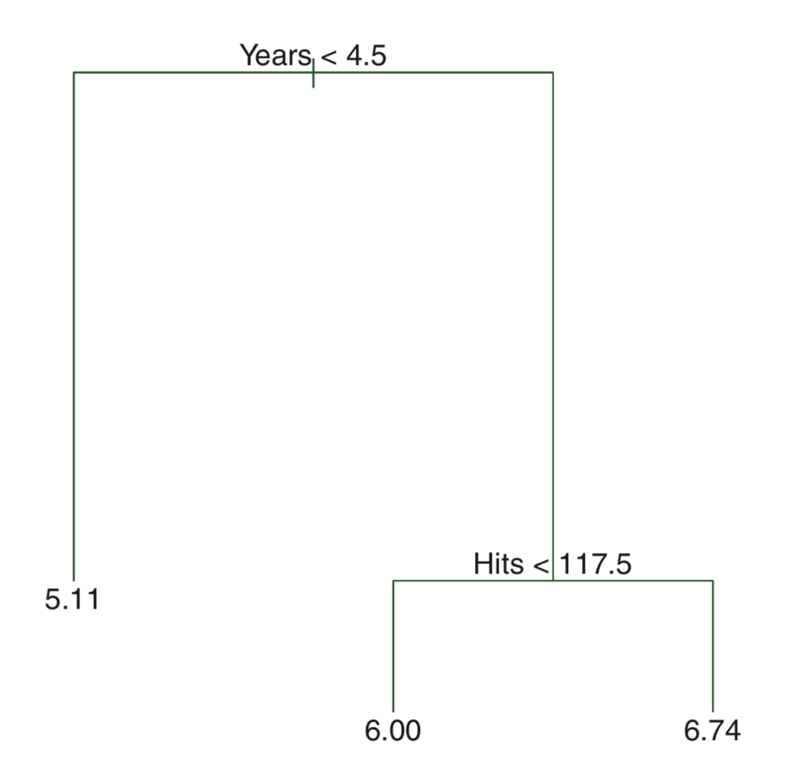
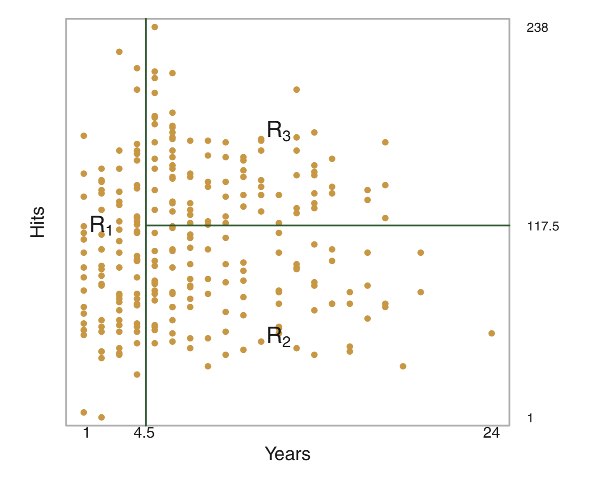
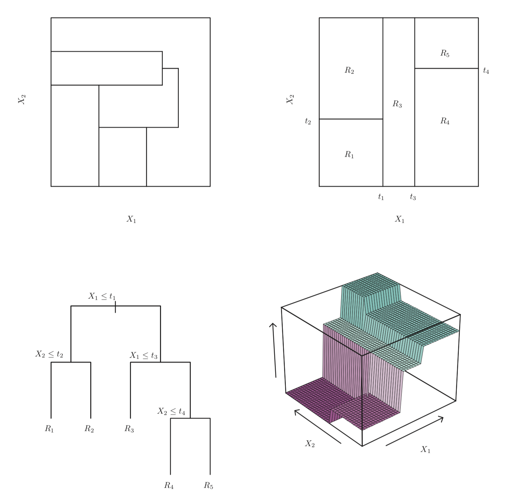
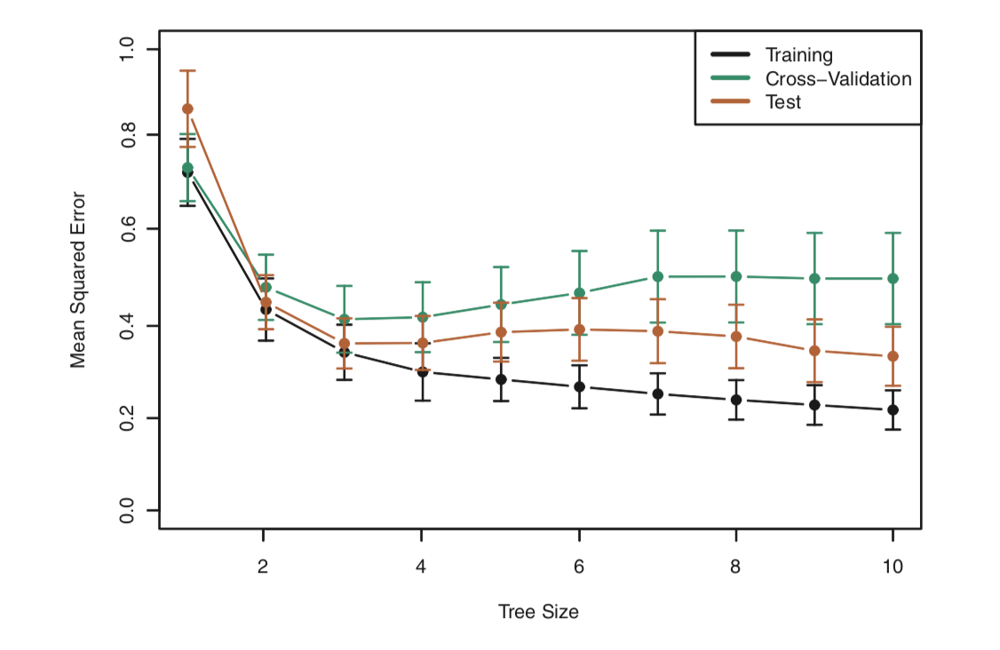
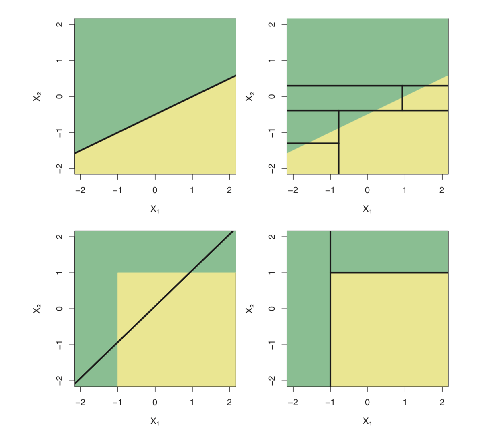
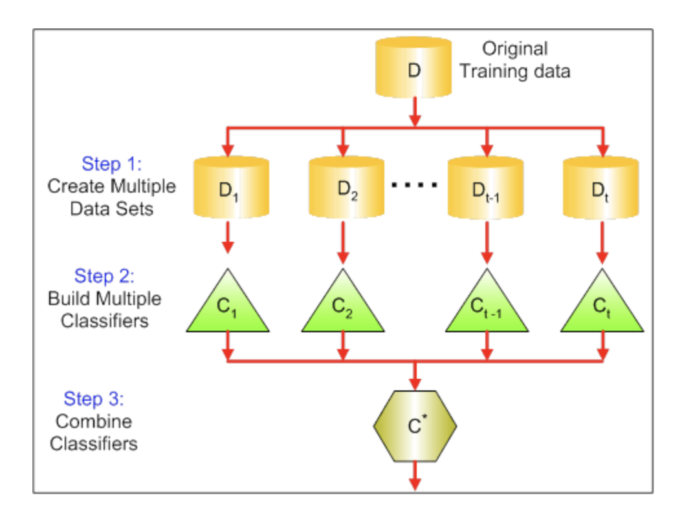
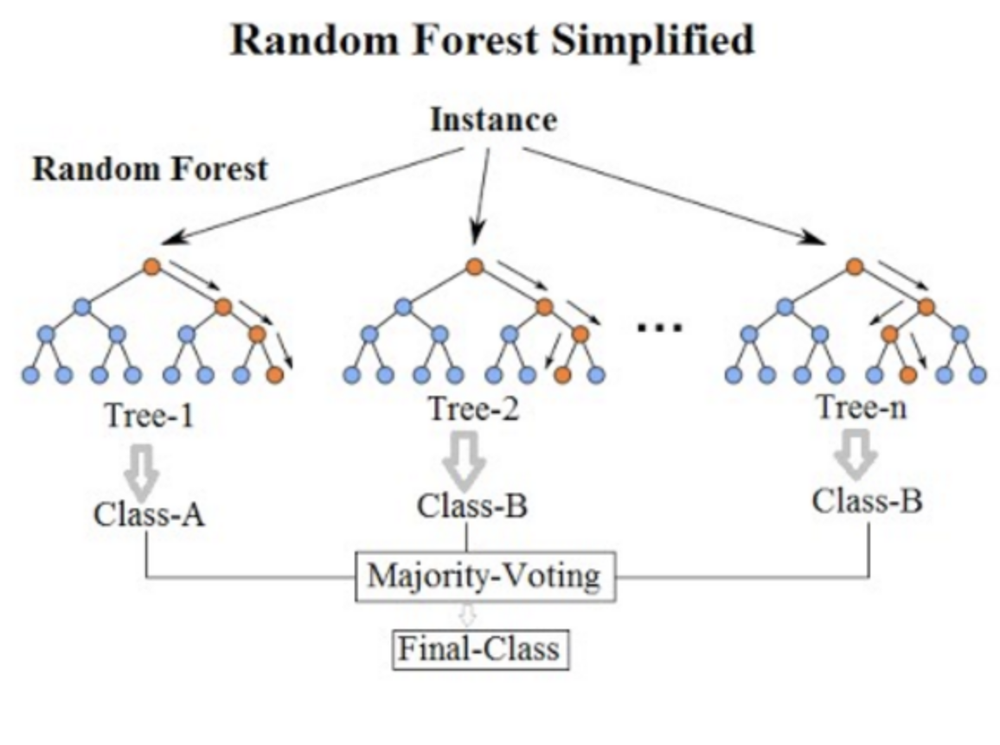
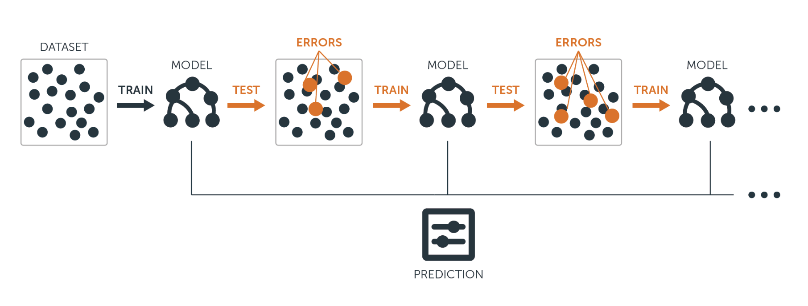

```{r setup, include=FALSE}
knitr::opts_chunk$set(echo = TRUE, eval = FALSE, message = FALSE, warning = FALSE)
```

## 의사결정나무

의사결정나무는 설명변수 공간을 여러 구역으로 나누고, 각 구역에 속한 훈련자료들의 평균(회귀) 또는 최빈값(분류)으로 예측하는 방법이다.

<메이저리그 타자의 연봉을 예측하는 문제>\




회귀 문제에서는 **RSS(Residual Sum of Squares)**를 최소화하는 구역 분할을 찾는 것이 목적이다.

$$\sum_{j=1}^J\sum_{i\in R_j}(y_i - \hat{y}_{R_j})^2$$

Rj: jth 설명변수 공간\
$\hat{y}_{R_j}$: jth 설명변수 공간에 속한 훈련 관측치 반응변수들의 평균값

분할은 보통 **top-down 방식의 반복적 이분 분할 (recursive binary splitting)**을 이용한다.



**단점**

탐욕적(greedy): 각 단계에서만 최적 분할을 선택 → 전체적으로 최적 구조를 보장하지 못함

과적합(overfitting)에 취약: 트리가 너무 복잡해져 새로운 데이터에는 성능이 떨어질 수 있음

## 가지치기

과적합 문제 해결을 위해 cost complexity pruning을 사용한다.

**cost complexity pruning (weakest link pruning)**\

$$\sum_{j=1}^J\sum_{i\in R_j}(y_i - \hat{y}_{R_j})^2 + \alpha T$$

T: subtree T의 number of terminal nodes\
$\alpha$: tuning parameter\
$\alpha$가 높으면, 더 단순한 트리 선택

즉, tuning parameter $\alpha$ 는 서브트리의 복잡도와 훈련자료에 대한 적합 사이의 trade-off 를 제어함.

k-fold CV 을 이용해서 검정오차를 $\alpha$의함수로 평가하고,평균 검정오차를최소로하는 $\alpha$를 선택



Linear model vs. Tree-based model



## 분류 오차

분류 문제에서는 오류율 $E = 1 - \max(\hat{p}_{mk})$ 대신, node purity에 민감한 지표 사용:

-   지니 지수(Gini index)
-   교차엔트로피(cross-entropy)

**Gini index**\
$$G = \sum_{k=1}^{K} \hat{p}_{mk}(1-\hat{p}_{mk})$$

**Cross-entropy**\
$$D = - \sum_{k=1}^{K} \hat{p}_{mk}log(\hat{p}_{mk})$$

## Bagging

배깅(bagging)은 bootstrap aggregation 의 약자. 여러 bootstrap 샘플로 학습한 모델을 평균/다수결로 결합해 분산을 줄인다.

$$\hat{f}_{bag}(x) = \frac{1}{B}\sum_{b=1}^{B}\hat{f}_b(x)$$



OOB(Out-of-Bag) 오차: 각 데이터가 포함되지 않은 트리들로 예측해 검증오차 추정

변수 중요도(Variable importance): 특정 변수 분할이 가져온 오차 감소량의 평균

## 랜덤 포레스트(Random Forest)

Bagging의 확장판.\
각 split 시 전체 변수 p 중 무작위로 m개만 고려 ($m \approx \sqrt{p}$)\
트리 간 상관성을 줄여 더 낮은 분산 달성

참고 자료

-   [Random Forest part I](https://www.youtube.com/watch?v=J4Wdy0Wc_xQ)
-   [Random Forest part II](https://www.youtube.com/watch?v=nyxTdL_4Q-Q)



## 부스팅(Boosting)

Bagging과 달리 bootstrap을 쓰지 않고, 전체 데이터를 순차적으로 학습하며 성능을 개선한다.

회귀 문제에서 Gradient boosting 알고리즘

1.  $\hat{f}(x)=0$이라하고, 훈련셋의 모든 i에대해 $r_i = y_i$ 로 설정한다. (r: residuals)
2.  b = 1,2,...,B 에 대하여 다음을 반복한다.

-   d개의 분할(d+1 터미널 노드)을 가진 트리 $\hat{f}^b$를 훈련자료 (X,r)에 적합한다.
-   새로운 트리의 수축 버전(수축 parameter $\lambda$ 를 곱한)을 더하여 $\hat{f}(x)$ 를 업데이트한다.

$$\hat{f}(x) \leftarrow \hat{f}(x) + \lambda \hat{f}^b(x)$$

-   잔차들을 업데이트한다.

$$r_i \leftarrow r_i - \lambda \hat{f}^b(x_i)$$

3.  부스팅 모델을 출력한다.

$$\hat{f}(x) = \sum_{b=1}^B \lambda \hat{f}^b(x)$$

Boosting 의 tuning parameters

-   B: number of trees
-   $\lambda$: 수축 파라미터 (학습 속도를 제어)
-   d: number of split in each tree (boosting의 복잡도를 제어)




## Lab.  

실습 데이터셋: 보스턴 주택가격 데이터셋\
- medv: median value of owner-occupied homes (단위: $1K)

```{r message=FALSE}
library(MASS)
head(Boston)
```

필요한 패키지 

```{r message=FALSE}
library(caret) # classification and regression training 
library(dplyr)
library(ggplot2)
```

데이터 분할
훈련/테스트 세트 분리 (75:25 비율)  

```{r}
set.seed(1) # quasi-randomization for reproducible result 
train_index = createDataPartition(1:nrow(Boston), p=0.75, list = FALSE) # return index vector 
train_boston = Boston[train_index,]
test_boston = Boston[-train_index,]
```

### Random Forest   

Tuning parameters   
-   ntree: number of trees (default, 500).
-   mtry: 분할 시 고려할 변수 개수 (보통 $\sqrt{p}$)   

모델학습 

```{r, message=FALSE}
trctrl = trainControl(method = "repeatedcv", number = 10, repeats = 2) # 
tunegrid = expand.grid(.mtry = c(2,7,13))  
rf_model = train(medv ~ ., data = train_boston, method = "rf", trControl = trctrl, tuneGrid = tunegrid, importance = TRUE)  
rf_model
```

성능확인(훈련데이터)

```{r}
plot(rf_model)
```

성능확인(테스트데이터)
예측값 vs. 실제값 시각화  

```{r}
pred = predict(rf_model, newdata = test_boston)
df = data.frame(prd = pred, obs =test_boston$medv)
df %>% 
  ggplot(aes(obs, prd)) + 
  geom_point() + 
  geom_abline(intercept = 0, slope = 1)
```


테스트 RMSE 계산  
```{r}
sqrt(mean((pred - test_boston$medv)^2))
```

변수 중요도

```{r}
rf_imp = varImp(rf_model, scale = F)
plot(rf_imp)
```

### Gradient boosting

모델학습 
```{r}
set.seed(9)
gbmGrid <-  expand.grid(
  interaction.depth = c(1,5,10), # 트리 깊이
  n.trees = 50*(1:10), # 트리 개수
  shrinkage = 0.1, # 학습률
  n.minobsinnode = 10) # 최소노드크기 
gbm_model = train(medv~., data = train_boston, trControl = trctrl, method = "gbm", tuneGrid = gbmGrid, verbose = F) 

gbm_model
```

성능 확인 (훈련 데이터)

```{r}
plot(gbm_model)
```

변수 중요도

```{r}
summary(gbm_model, las = 1)
```

성능 확인 (테스트 데이터)

```{r}
gbm_pred = predict(gbm_model, newdata = test_boston)
sqrt(mean(gbm_pred - test_boston$medv)^2)
```

### 모델 비교 (Random Forest vs. Gradient Boosting)

```{r}
resamps = resamples(list(RF = rf_model, 
               GBM = gbm_model)) # 두 모델의 cross-validation 성능 결과(예: RMSE, R² 등)를 반환 
summary(resamps)
bwplot(resamps) # Box-and-Whisker plot
```