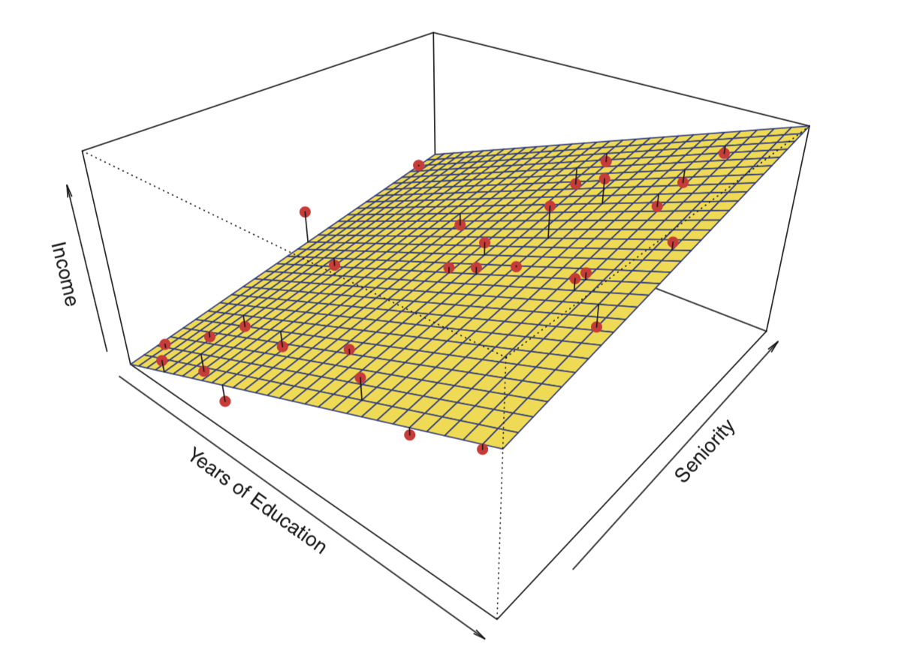
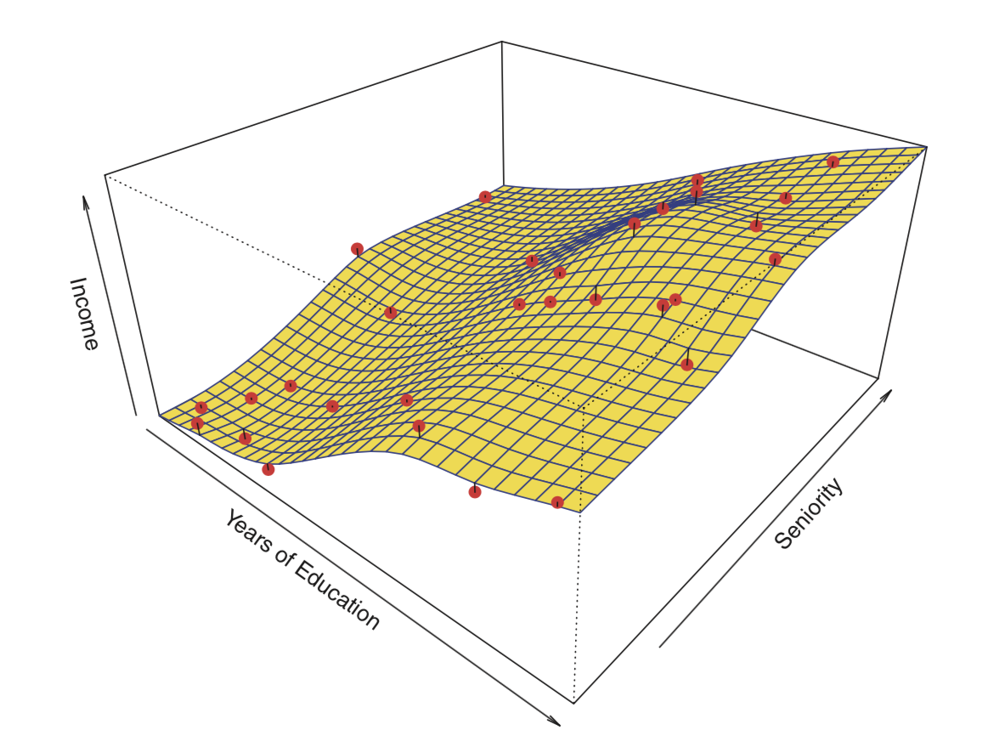
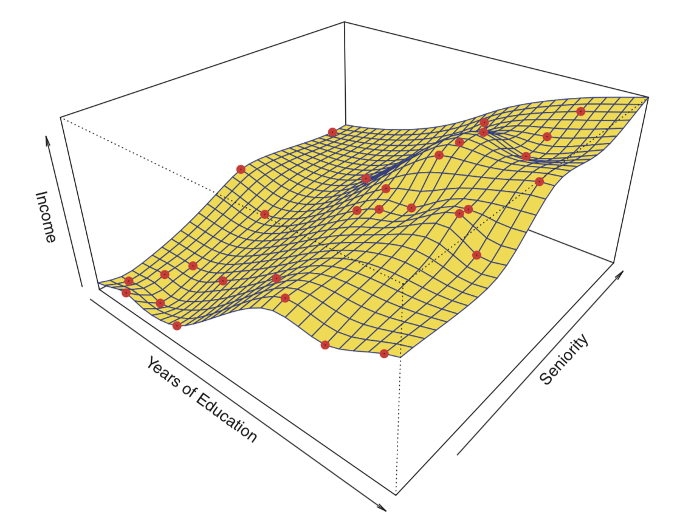
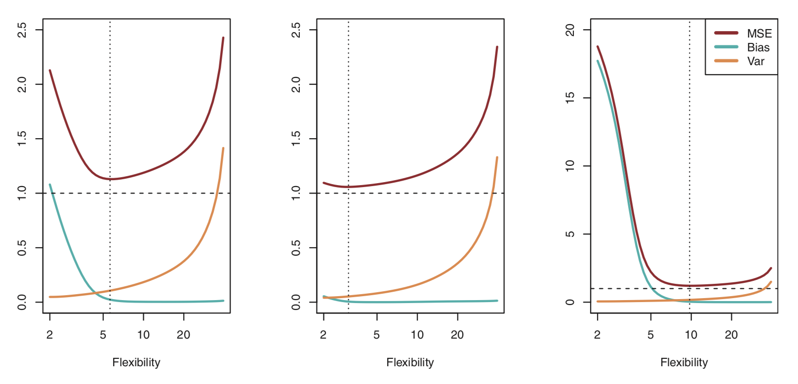
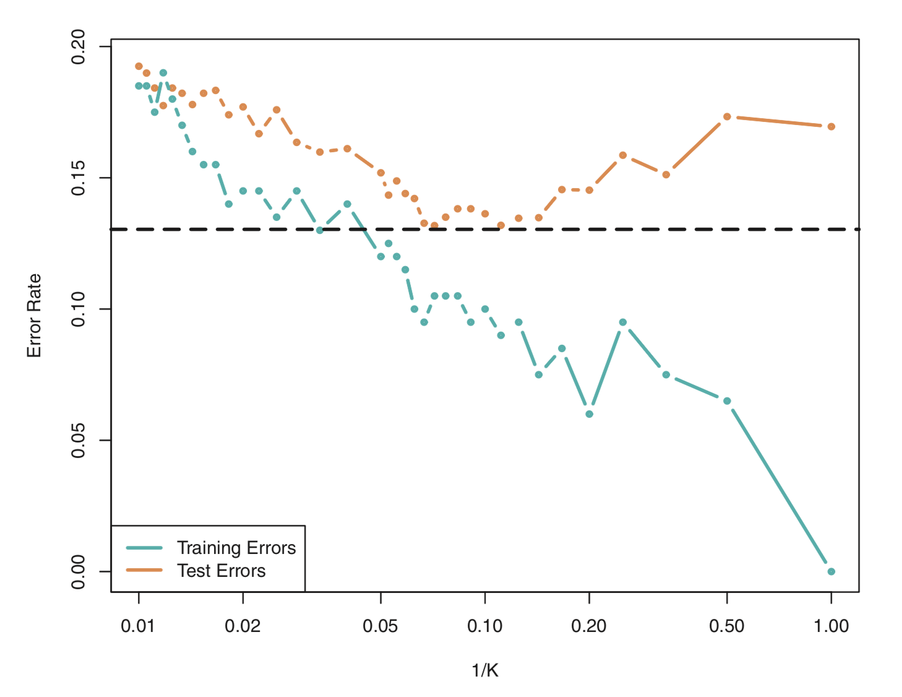

```{r setup, include=FALSE}
knitr::opts_chunk$set(echo = TRUE, eval = FALSE, message = FALSE, warning = FALSE)
```

**학습목표**

-   추론과 예측의 차이점을 구분하고, 각각의 목표와 활용사례를 이해한다.
-   편향과 분산 절충 관계를 이해하여 모델의 유연성과 정확성의 관계를 설명할 수 있다.
-   R을 사용하여 ....

## 통계적 모델링, 기계학습, 인공지능

목표와 접근 방식에서의 차이에 주목

### 통계적 모델링

확률모형(예: 정규성, 독립성 등)을 전제로 데이터가 생성되는 과정을 수학적으로 기술하고 모수를 추정하고, 가설을 검정

> All models are wrong. Some models are useful.\
> - George Box

예\> 선형회귀, 로지스틱 회귀, 콕스비례위험 회귀, 혼합효과 모형 등

**장점**\
- 해석 용이("X가 1 증가하면 Y는 β만큼 변화")

**한계**\
- 모형 가정 위반에 민감(비선형성, 이분산성, 비례위험 위반 등)

### 기계학습

명시적 확률분포 가정보다 데이터 기반의 패턴 인식으로 예측 성능을 극대화.

예\> Random forest, support vector machine, gradient boosting, artificial neural network, etc

**장점**\
- 비선형·고차원 관계 포착 - 대규모 데이터에서 높은 성능

**한계**\
- 해석력 낮을 수 있음(블랙박스)\
- 과적합(overfitting) 위험

### 인공지능

지각(perception)·추론(reasoning)·의사결정(decision making) 등 인간 수준의 **지능**적 기능을 구현하려는 컴퓨터 시스템.

예\> 자연어 처리, 컴퓨터 비전, 음성 인식, 추천 시스템, 자율주행 등

**목표**\
- 지능적 자동화\
- 상호작용(물리적 작용을 포함)

**특징**\
- 규칙 기반(rule-based) -\> 기계학습(특히 딥러닝)\
- 방대한 데이터(data)·연산자원(compute) 필요\
- 응용 중심(의료영상 판독, 임상노트 요약 등)\
- 설명가능성/안전성/공정성 이슈\
\

**요약**

| 구분        | 통계적 모델링                | 기계학습               | 인공지능                   |
|-------------|------------------------------|------------------------|----------------------------|
| 주목적      | **설명·추론** (효과크기, CI) | **예측 성능** (일반화) | **지능적 기능** 구현       |
| 가정        | 강함(정규성, 독립성, PH 등)  | 약하거나 없음          | 강함(규칙) -\> 약함(ML/DL) |
| 데이터 요구 | 적은 표본도 가능             | 많을수록 유리          | 매우 많음(딥러닝)          |
| 해석 가능성 | 높음                         | 제한적                 | 낮을 수 있음               |
| 전형적 출력 | β, OR/HR, p, CI              | 예측값·확률, 중요도    | 작업별 성능지표            |
| 대표 기법   | 회귀·Cox 등                  | RF/XGB/SVM/NN          | DL(NLP/CV), 에이전트       |

**무엇을 언제 쓸까? (선택 가이드)**

효과 추정·인과추론·정책 근거가 핵심 → 통계적 모델링 예: 고혈압약 복용이 치매 위험에 미치는 HR 추정(Cox)

정확한 예측이 핵심 → 기계학습 예: 환자 개별 발생 위험 예측 모델(XGBoost)

복합 지능 기능 구현 → 인공지능(딥러닝) 예: 영상에서 병변 자동 탐지, 임상노트 요약

혼합 접근  예\> ML로 예측 → SHAP (SHappley Additive Explanation) 등으로 설명 보강, 통계모형으로 핵심 효과 재검증 등.

## 지도(supervised), 비지도(unsupervised), 강화(reinforced) 학습

#### 지도 학습

-   입력과 정답이 주어진 상태에서 모델을 학습\
-   예) 환자의 나이, 혈압, 인지기능 등 입력 데이터 → 치매 여부(있음/없음)\
-   대표 알고리즘: 선형회귀, 로지스틱 회귀, 랜덤 포레스트, SVM, 신경망 등

#### 비지도 학습

-   정답(Y)가 주어지지 않고 입력(X)만 있는 상태에서 데이터 구조를 학습\
-   예: 환자 집단을 여러 패턴(약물 복용 유형, 생활 습관)에 따라 군집화\
-   대표 알고리즘: K-means, PCA, Autoencoder 등.

#### 강화 학습

-   에이전트(agent)가 환경(environment)과 상호작용하며 행동(action)을 선택하고, 그에 따른 보상(reward)을 받아 \*\*누적 보상(max cumulative reward)\*\*을 극대화하는 방향으로 학습\
-   예: 의학적 치료 정책을 시뮬레이션 환경에서 최적화하는 경우, 로봇 수술 보조 시스템.\
-   대표 알고리즘: Q-learning, SARSA, Deep Q-Network(DQN), Policy Gradient, Actor-Critic 등.

## 지도 학습

지도 기계학습은 $X$와 $Y$의 관계를 다음 식으로 나타낼 때, f (함수, 혹은 모델)를 추정(estimate)하는 것

$$Y = f(X) + e$$

$X$ ($X_1$ + $X_2$ + ... + $X_p$): features\
$Y$; response variable\
$e$; random error term (independent of $X$, mean = 0)

위 식에서 $e$은 오차항

### f를 추정하는 이유

**추론**

X가 변함에 따라 Y가 영향을 받는가, 어떻게 영향을 받는가에 관심\
- 어떤 예측 변수들이 결과 변수 값과 연관되어 있는가?\
- 예측 변수와 결과 변수간에는 어떤 연관성이 있는가? 선형 관계인가 아니면 더 복잡한 관계인가?

**예측**

예측 문제에서 $\hat{f}$은 보통 블랙박스로 취급

$$\hat{Y} = \hat{f}(X)$$

$\hat{Y}$은 Y에 대한 예측(prediction) 결과, $\hat{f}$은 f에 대한 추정\
$\hat{Y}$의 정확성은 오차를 얼마나 줄일 수 있느냐에 달려있음\
오차는 크게 축소가능한 오차(reducible error)와 축소불가능한 오차(irreducible error)로 구분\
축소가능 오차(reducible error): 가장 적절한 기계학습 기법을 사용하여 f를 추정함으로써 $\hat{f}$의 정확성을 개선\
축소불가능 오차(irreducible error): 근본적으로 측정할 수 없는 변동성이나, 측정되지 않은 어떤 유용한 변수들에 기인하는 오차\
축소불가능 오차는 예측 정확도의 상한선

## 모델의 유연성과 해석 가능성(Model flexibility & Interpretability)







추론에는 관심이 없고, 예측에만 관심이 있다면 가장 유연한 모델을 사용하는 것이 해석력을 희생하더라도 정확성을 높일 수있는 최선의 선택이라고 예상할 수 있다.

그러나, 덜 유연한 방법을 사용할 때 더 정확한 예측을 얻을 수 있는 사례들을 종종 볼 수 있다.

직관에 반하는 것처럼 보이는 이러한 현상을 어떻게 설명할 수 있을까?

이것은 아주 유연한 방법들이 지닌 잠재적인 과적합(overfitting)의 문제와 관련이 깊다. 이것에 대해 상세히 설명하기에 앞서 모델의 정확도를 어떻게 평가할지에 대해 먼저 살펴보자.

## 모델의 정확도 평가

기계 학습 모델의 정확도를 어떻게 평가할까? 회귀와 분류로 나누어 살펴보자.

#### 회귀(Regression)

기계학습 모델의 성능을 평가한다는 것은 예측치와 관측치가 얼마나 일치하는지 측정한다는 것

회귀 문제에서 가장 일반적으로 사용되는 척도는 아래 식으로 주어지는 평균제곱오차(mean squared error), 혹은 제곱근을 씌운 root mean squared error

Mean Squared Error (MSE)

$$MSE = \frac{1}{n}\sum_{i=1}^{n}(y_i - \hat{f}(x_i))^2$$

학습 데이터(training data)를 이용하여 계산한 MSE는 training MSE

중요한 것은 검정 데이터(test data)에 적용할 때 얻는 예측 정확도, 즉, test MSE

#### 분류(Classification)

분류 문제에서 분류기 $\hat{f}$의 정확도를 수량화하는 가장 흔한 지표는 아래 식으로 주어지는 오차율(error rate)

오차율(Error rate)

$$\frac{1}{n}\sum_{i=1}^{n}I(y_i \neq \hat{y_i})$$

$\hat{y_i}$는 $\hat{f}$를 사용하여 예측된 i번째 관측치에 대한 클래스 표시(label)이고,\
$I(y_i \neq \hat{y_i})$는 indicator function 으로 $y_i \neq \hat{y_i}$이면 1이고, $y_i = \hat{y_i}$이면 0을 반환

## 편향-분산 절충(Bias-Variance trade-off)

편향(Bias): 추정치가 실제값에서 얼마나 벗어나 있는가?

분산: 학습 데이터(training data)에 따라 추정치가 얼마나 변화하는가?

일반적으로 더 유연한 모델을 사용할 때 편향은 줄어드나, 분산은 증가

즉, 모델의 유연성을 증가시킴에 따라 편향의 감소가 검정 데이터(test data)에서의 오차를 줄이지만, 어느 지점을 넘어서면 편향의 감소분에 비해 분산의 증가분이 더 커져 검정 데이터에서의 오차는 오히려 증가함. 이를 과적합(overfitting)이라고 함.\
따라서, 최적의 모델을 만드는 것은 결국 분산과 편향의 절충 문제로 볼 수 있음.





> 공짜 점심은 없다(No free lunch theorem)

누구에게나 공짜로 최고의 점심을 줄 수는 없는 것처럼, 기계학습에서도 특정 알고리즘이 모든 상황에서 최선일 수는 없다는 것.

-   알고리즘 선택은 문제 특성에 따라 달라져야 한다\
    (예: 데이터 크기, 차원, 노이즈, 선형성 여부 등)\
-   모델 검증(Validation)과 비교가 필수적\
-   여러 알고리즘을 실험해보고 가장 적합한 것을 선택해야 한다\

#### Lab

아래 (a)에서 (c)까지의 각 항목에 대해, 유연한 기계학습 방법의 성능이 덜 유연한 방법보다 더 우수하거나 혹은 더 나쁠 것으로 예상하는지 여부를 표시하고, 왜 그렇게 생각하는지 설명하십시오.

(a) 표본 크기 n은 매우 크며 예측 변수 p의 수는 적다.
(b) 예측 변수 p의 수는 매우 많고, 관측 수 n은 적다.
(c) 예측 자와 반응 사이의 관계가 매우 비선형적이다.
